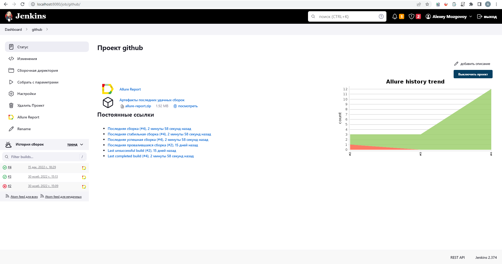

# Training project

## :rocket: Tools

<p  align="center">

<code></code>
<code></code>
<code></code>
<code></code>
<code></code>
<code></code>
<code></code>
<code></code> 
<code></code>
<code></code>
<code></code>
<code></code>
</p>

> *In this project, autotests are written in <code><strong>*Java*</strong></code> using the framework <code><strong>*Selenide*</strong></code> for UI-tests and <code><strong>*REST-Assured*</strong></code> for API-tests.*
>
>*Project bilder is <code><strong>*Gradle*</strong></code>.*
>
>*<code><strong>*JUnit 5*</strong></code> used as a framework for unit testing.*
>
>*The tests were run from <code><strong>*Jenkins*</strong></code>.*
>
>*<code><strong>*Selenoid*</strong></code> used to launch browsers in containers  <code><strong>*Docker*</strong></code>.*
>
>*<code><strong>*Allure Report*</strong></code> used to visualize test results.*

## :spiral_notepad: Check list

### &nbsp;&nbsp;&nbsp;&nbsp;&nbsp;&nbsp; UI tests


>-  *Login Page*
>- [x] *Login page title should have header text*
>- [x] *Login page should not have console log errors*
>- [x] *Login successful*
>- [x] *Try to login to the System with an invalid data*
>- [x] *Try to login to the System without specifying a password*
>- [x] *Try to login to the System without any data*
>- [x] *Go to page 'Forgot password'*
>-  *Main Page*
>- [x] *Page title should have header text*
>- [x] *Page console log should not have errors*
>- [x] *Search field should work as expected*

### &nbsp;&nbsp;&nbsp;&nbsp;&nbsp;&nbsp; API tests

>- [x] *Check main page status code*
>- [x] *Check content type*


## :computer: Running tests from the terminal

&nbsp;&nbsp;&nbsp;&nbsp;&nbsp;&nbsp;:green_circle:&nbsp;&nbsp;*Running tests with completed remote.properties:*

```bash
gradle clean test
```

&nbsp;&nbsp;&nbsp;&nbsp;&nbsp;&nbsp;:green_circle:&nbsp;&nbsp;*Running tests without completed remote.properties:*

```bash
gradle clean test 
  -Dbrowser=[BROWSER]
  -DbrowserVersion=[BROWSER_VERSION]
  -DbrowserSize=[BROWSER_SIZE]
  -DremoteDriverUrl=https://[selenoidUser]:[selenoidPwd]@[REMOTE_DRIVER_URL]/wd/hub/
  -DvideoStorage=https://[REMOTE_DRIVER_URL]/video/
  -Dthreads=[THREADS]
  -DbaseUrl=[BASE_URL]
```

&nbsp;&nbsp;&nbsp;&nbsp;&nbsp;&nbsp;:green_circle:&nbsp;&nbsp;*Running Tests in Multiple Threads:*

```bash
gradle clean test -Dthreads=[threadsValue]
```

&nbsp;&nbsp;&nbsp;&nbsp;&nbsp;&nbsp;:green_circle:&nbsp;&nbsp;*Create allure report:*

```bash
allure serve build/allure-results
```

##  Running tests in Jenkins

### :pushpin: Build Options

    BROWSER (default chrome)
    BROWSER_VERSION (default 100.0)
    BROWSER_SIZE (default 1920x1080)
    REMOTE_DRIVER_URL (url-address selenoid, default selenoid.autotests.cloud)
    TREADS (default 5)
    BASE_URL 

<p align="center">
  
</p>

##  Allure report  

<p align="center">
   
</p>
